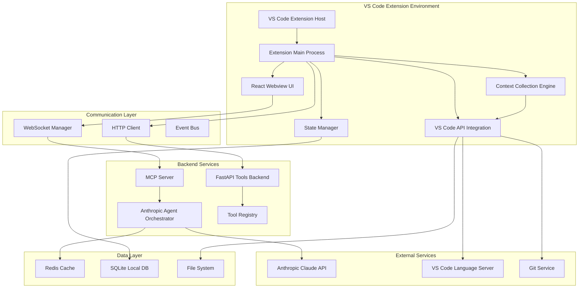
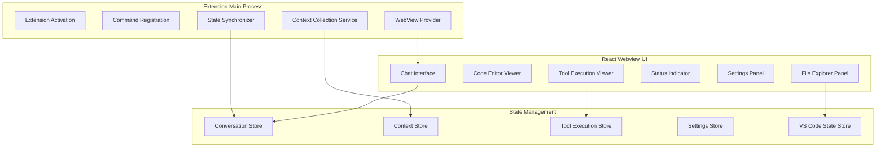
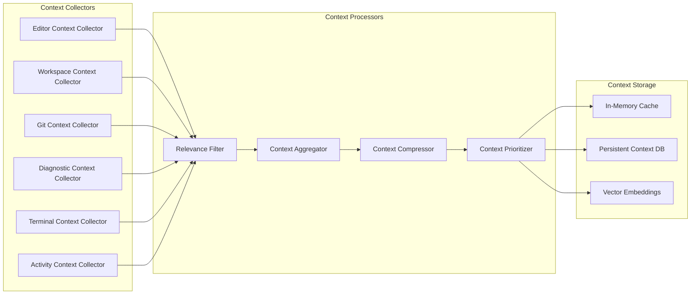
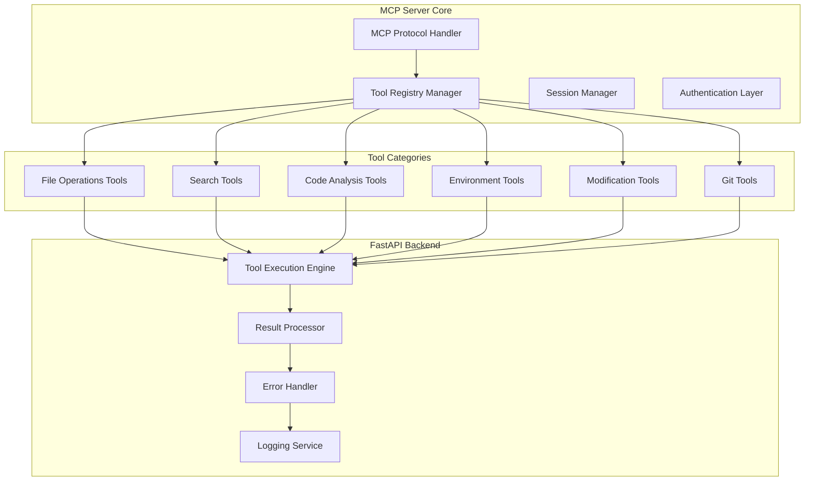
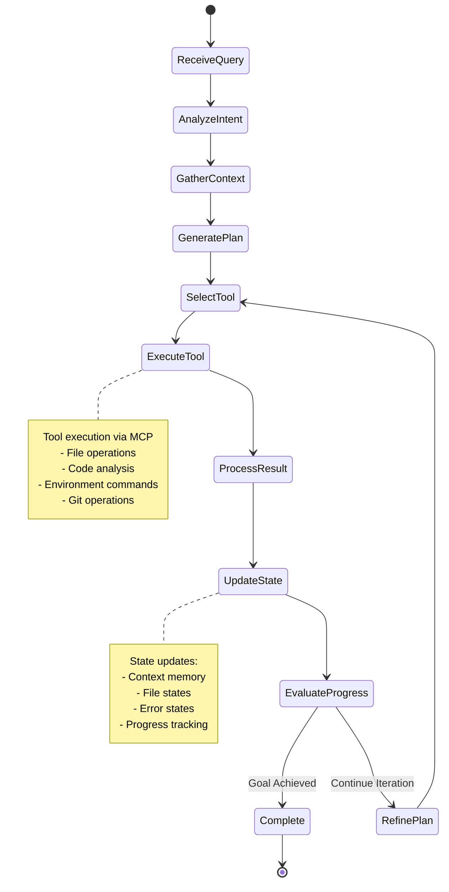
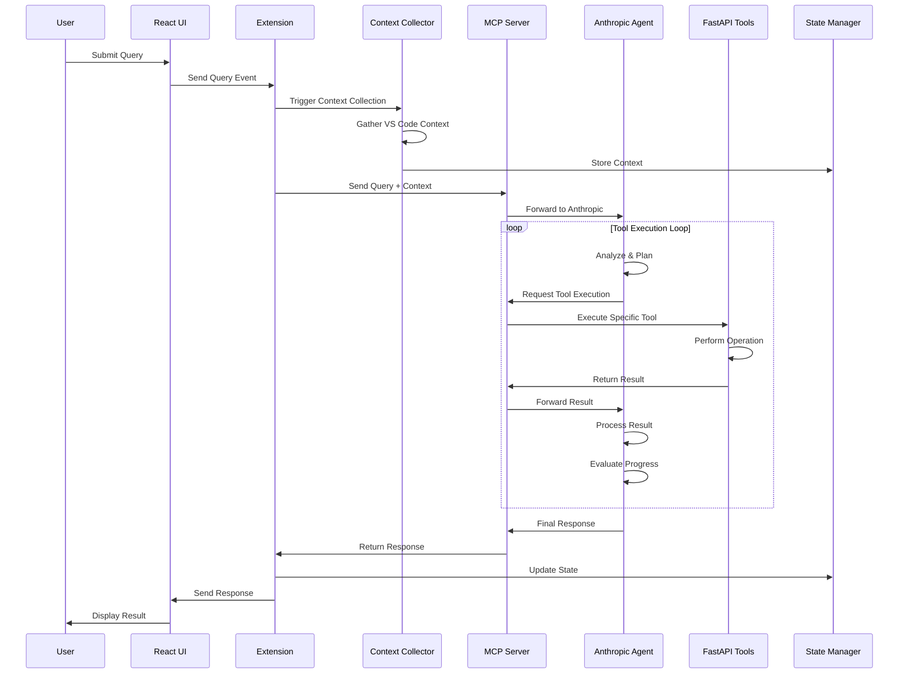
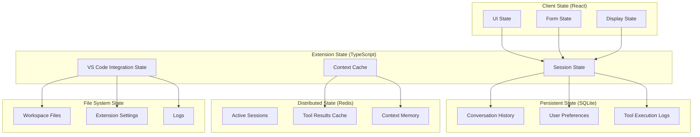
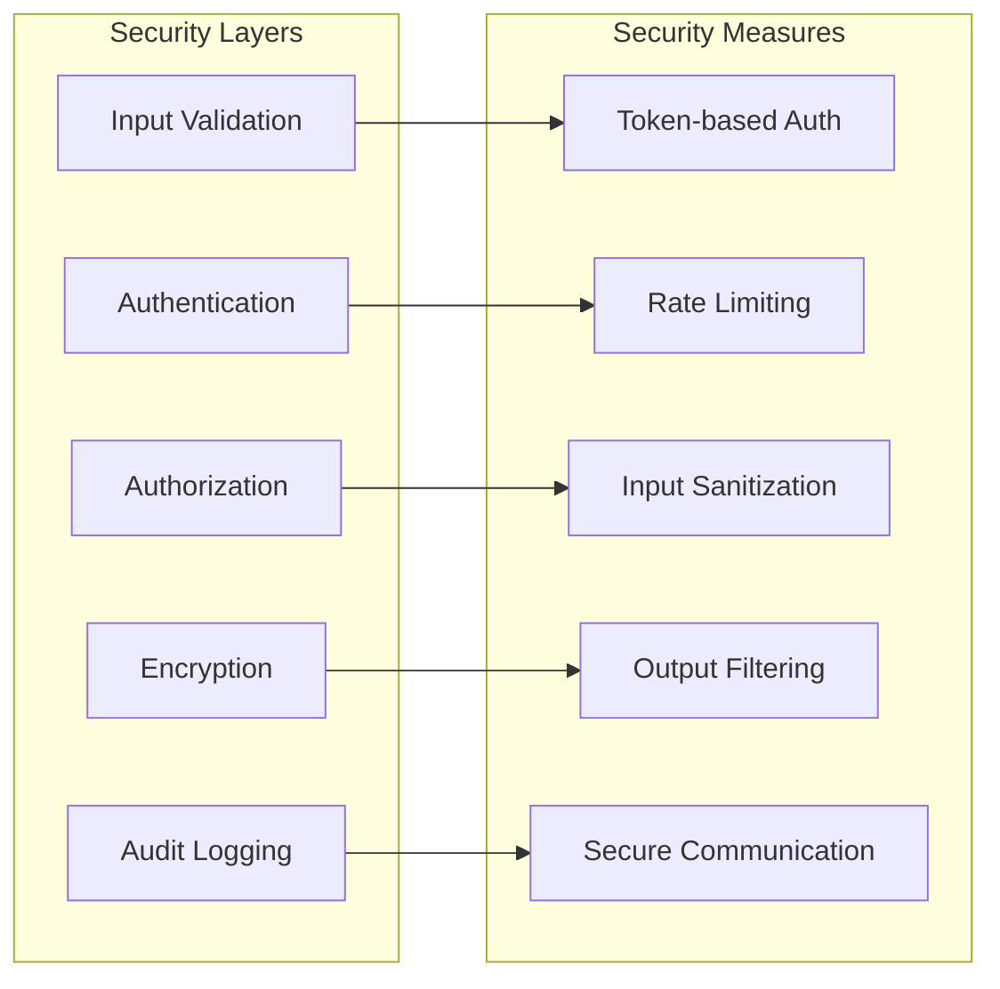

graph TD
    A[User Input/Query] --> B[Input Processing & Validation]
    B --> C[Context Collection Phase]
    
    C --> C1[Current Editor State]
    C --> C2[Workspace Analysis]
    C --> C3[Environment State]
    C --> C4[Error & Diagnostic Collection]
    C --> C5[Recent Activity Tracking]
    
    C1 --> C1a[Active Text Editor]
    C1 --> C1b[Cursor Position & Selection]
    C1 --> C1c[Open Tabs/Documents]
    C1 --> C1d[Editor Configuration]
    
    C2 --> C2a[Workspace Folders]
    C2 --> C2b[File Tree Structure]
    C2 --> C2c[Git Status & Changes]
    C2 --> C2d[Project Configuration Files]
    
    C3 --> C3a[Terminal Sessions]
    C3 --> C3b[Running Tasks]
    C3 --> C3c[Debug Sessions]
    C3 --> C3d[Extension State]
    
    C4 --> C4a[Linter Errors/Warnings]
    C4 --> C4b[Syntax Errors]
    C4 --> C4c[Type Errors]
    C4 --> C4d[Build Errors]
    
    C5 --> C5a[Recently Modified Files]
    C5 --> C5b[Command History]
    C5 --> C5c[Search History]
    C5 --> C5d[File Access Patterns]
    
    C1a & C1b & C1c & C1d & C2a & C2b & C2c & C2d & C3a & C3b & C3c & C3d & C4a & C4b & C4c & C4d & C5a & C5b & C5c & C5d --> D[Context Aggregation]
    
    D --> E[Query Analysis & Intent Recognition]
    E --> F[Planning Phase]
    
    F --> G{Query Type?}
    
    G -->|Code Modification| H1[Code Change Plan]
    G -->|Information Seeking| H2[Information Gathering Plan]
    G -->|Debugging| H3[Debug Investigation Plan]
    G -->|Refactoring| H4[Refactoring Plan]
    G -->|Testing| H5[Testing Plan]
    
    H1 & H2 & H3 & H4 & H5 --> I[Tool Selection & Execution Loop]
    
    I --> J{Tool Execution}
    
    J -->|File Operations| K1[File Access Tools]
    J -->|Search Operations| K2[Search Tools]
    J -->|Code Analysis| K3[Analysis Tools]
    J -->|Environment| K4[Environment Tools]
    J -->|Modification| K5[Modification Tools]
    
    K1 --> K1a[Read File Content]
    K1 --> K1b[List Directory]
    K1 --> K1c[File Metadata]
    K1 --> K1d[File Search by Name]
    
    K2 --> K2a[Semantic Code Search]
    K2 --> K2b[Regex/Text Search]
    K2 --> K2c[Symbol Search]
    K2 --> K2d[Reference Search]
    
    K3 --> K3a[AST Analysis]
    K3 --> K3b[Type Information]
    K3 --> K3c[Dependency Analysis]
    K3 --> K3d[Code Metrics]
    
    K4 --> K4a[Terminal Command Execution]
    K4 --> K4b[Process Management]
    K4 --> K4c[Environment Variables]
    K4 --> K4d[Git Operations]
    
    K5 --> K5a[File Creation/Deletion]
    K5 --> K5b[Text Editing]
    K5 --> K5c[Multi-file Refactoring]
    K5 --> K5d[Code Generation]
    
    K1a & K1b & K1c & K1d & K2a & K2b & K2c & K2d & K3a & K3b & K3c & K3d & K4a & K4b & K4c & K4d & K5a & K5b & K5c & K5d --> L[Tool Result Processing]
    
    L --> M[State Update]
    M --> M1[Update Context Memory]
    M --> M2[Update File States]
    M --> M3[Update Error States]
    M --> M4[Update Progress]
    
    M1 & M2 & M3 & M4 --> N{Goal Achieved?}
    
    N -->|No| O[Plan Refinement]
    O --> I
    
    N -->|Yes| P[Response Generation]
    
    P --> Q[Output Formatting]
    Q --> Q1[Code Snippets with Line Numbers]
    Q --> Q2[File Diffs/Changes]
    Q --> Q3[Explanation Text]
    Q --> Q4[Action Items]
    Q --> Q5[Error Resolutions]
    
    Q1 & Q2 & Q3 & Q4 & Q5 --> R[Response Delivery]
    
    R --> S[VS Code Integration]
    S --> S1[Update Editor Content]
    S --> S2[Show Notifications]
    S --> S3[Update Status Bar]
    S --> S4[Open Relevant Files]
    S --> S5[Highlight Changes]
    
    S1 & S2 & S3 & S4 & S5 --> T[Session State Persistence]
    T --> T1[Save Conversation History]
    T --> T2[Update Workspace State]
    T --> T3[Cache Tool Results]
    T --> T4[Update User Preferences]
    
    T1 & T2 & T3 & T4 --> U[End of Cycle]
    
    style A fill:#e1f5fe
    style B fill:#f3e5f5
    style C fill:#e8f5e8
    style D fill:#fff3e0
    style E fill:#fce4ec
    style F fill:#e0f2f1
    style I fill:#fff8e1
    style P fill:#e8eaf6
    style R fill:#f1f8e9
    style U fill:#ffebee


I'll design a comprehensive system architecture for your VS Code extension agent. Let me break this down step by step as an expert system designer.

## **System Architecture Overview**



## **Detailed Component Architecture**

### **1. Frontend Layer (VS Code Extension)**

#### **Tech Stack:**
- **Extension**: TypeScript + VS Code Extension API
- **UI**: React 18 + TypeScript + Vite
- **State Management**: Zustand + React Query
- **Styling**: Tailwind CSS + VS Code Theme API
- **Communication**: WebSocket + REST API

#### **Components:**



### **2. Context Collection Engine**

#### **Implementation Strategy:**



### **3. Backend Services Architecture**

#### **MCP Server Design:**



### **4. Anthropic Agent Orchestrator**

#### **Agent Flow Design:**



## **Data Flow Architecture**

### **Request Processing Pipeline:**



## **State Management Architecture**

### **Multi-Layer State Design:**



## **Technology Stack Breakdown**

### **Frontend Stack:**
```yaml
Extension Core:
  - TypeScript 5.0+
  - VS Code Extension API
  - Node.js Runtime

UI Framework:
  - React 18.2+
  - TypeScript 5.0+
  - Vite 4.0+ (build tool)
  - Tailwind CSS 3.0+

State Management:
  - Zustand (lightweight state)
  - React Query (server state)
  - Immer (immutable updates)

Communication:
  - WebSocket (real-time)
  - Axios (HTTP client)
  - EventEmitter (internal events)
```

### **Backend Stack:**
```yaml
MCP Server:
  - Python 3.11+ / TypeScript
  - MCP Protocol Implementation
  - WebSocket Server
  - FastAPI Integration

Tools Backend:
  - FastAPI 0.104+
  - Pydantic (data validation)
  - AsyncIO (async operations)
  - Pytest (testing)

AI Integration:
  - Anthropic Claude API
  - LangChain (optional orchestration)
  - Custom prompt templates

Data Layer:
  - Redis (caching/sessions)
  - SQLite (local persistence)
  - File System (workspace data)
```

## **Communication Protocols**

### **WebSocket Protocol Design:**

```typescript
interface WSMessage {
  type: 'query' | 'context' | 'tool_execution' | 'response' | 'error' | 'status'
  id: string
  timestamp: number
  payload: any
  metadata?: {
    sessionId: string
    userId: string
    contextHash: string
  }
}

interface ToolExecutionEvent {
  toolId: string
  toolName: string
  parameters: Record<string, any>
  status: 'started' | 'running' | 'completed' | 'failed'
  result?: any
  error?: string
  executionTime?: number
}
```

## **Security & Performance Considerations**

### **Security Architecture:**


### **Performance Optimizations:**
- **Context Compression**: Intelligent context summarization
- **Tool Caching**: Cache frequently used tool results
- **Lazy Loading**: Load UI components on demand
- **Background Processing**: Non-blocking operations
- **Memory Management**: Efficient garbage collection

## **Deployment Architecture**

### **Development Environment:**
```yaml
Local Development:
  - VS Code Extension Development Host
  - Local MCP Server
  - Local Redis Instance
  - Hot Reload for React UI

Testing Environment:
  - Extension Tests (Jest/Mocha)
  - UI Tests (React Testing Library)
  - Integration Tests (Playwright)
  - Load Tests (Artillery/k6)

Production:
  - Extension Marketplace
  - Cloud-hosted MCP Server
  - Managed Redis/Database
  - CDN for static assets
```

This architecture provides a robust, scalable foundation for building a Cursor-like agent extension for VS Code, with clear separation of concerns, efficient state management, and extensible tool integration through the MCP protocol.
