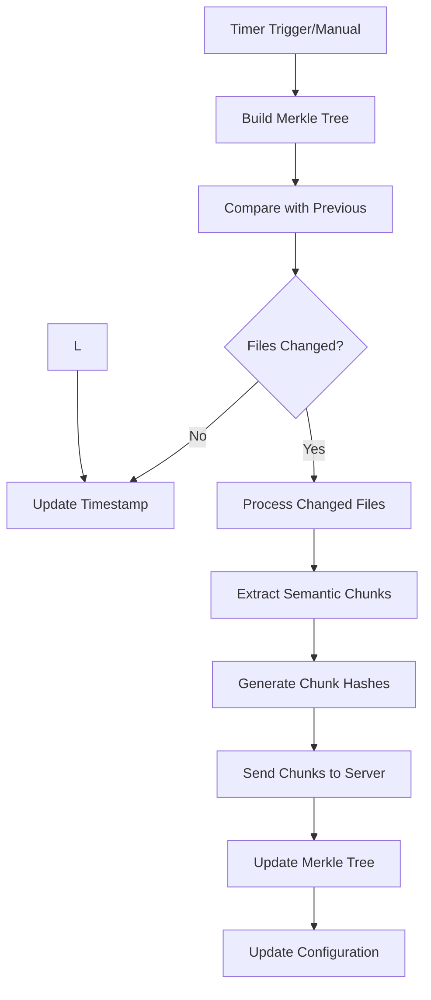

# Code Base Indexing System

This system provides intelligent code base indexing with branch-specific merkle tree storage to avoid duplicate chunks when switching between git branches.

## 🚀 Features

- **Efficient Change Detection**: Uses Merkle trees to detect file changes with minimal overhead
- **Semantic Code Chunking**: Leverages chonkie for intelligent parsing and semantic chunking
- **Git Integration**: Automatically handles branch changes and triggers re-indexing
- **Persistent Storage**: Uses VSCode's storage API for reliable data persistence
- **Server Synchronization**: Compresses and sends chunks to server for embedding calculation
- **Performance Optimized**: Processes files in batches with configurable concurrency
- **Real-time Monitoring**: Provides status updates and statistics

## 📁 Architecture

```
extension/src/indexing/
├── types/                  # TypeScript interfaces and types
│   └── chunk.ts           # Core data structures
├── utils/                  # Utility functions
│   └── hash.ts            # Hashing utilities
├── core/                   # Core indexing components
│   ├── merkle-tree-builder.ts      # Merkle tree construction and comparison
│   ├── tree-sitter-chunker.ts      # Semantic code chunking
│   ├── git-monitor.ts              # Git branch monitoring
│   ├── indexing-orchestrator.ts    # Main orchestration logic
│   └── server-communication.ts     # Server API communication
├── storage/                # Data persistence
│   └── vscode-storage.ts   # VSCode storage integration
├── index.ts               # Main module exports
└── README.md             # This file
```

## 🔧 Technology Stack

### Client-Side Dependencies
- **chonkie**: for chunking
- **MerkleTreeJS**: Merkle tree implementation for change detection
- **VSCode API**: Storage and file system integration
- **Node.js zlib**: Data compression
- **Axios**: HTTP client for server communication

### Supported Languages
- JavaScript/TypeScript
- Python
- Java
- C/C++
- C#, PHP, Ruby, Go, Rust, Swift, Kotlin

## 🎯 Core Components

### 1. Merkle Tree Builder (`merkle-tree-builder.ts`)

Builds and compares Merkle trees for efficient change detection:

```typescript
const builder = new MerkleTreeBuilder();
const merkleTree = await builder.buildTree(workspacePath);
const changedFiles = builder.compareTree(oldTree, newTree);
```

**Features:**
- File filtering with glob patterns
- Recursive directory traversal
- Hash-based change detection
- Configurable include/exclude patterns

### 2. Tree-sitter Chunker (`tree-sitter-chunker.ts`)

Performs semantic code chunking using Tree-sitter parsers:

```typescript
const chunker = new TreeSitterChunker(workspaceHash, gitBranch);
const chunks = await chunker.chunkFile(filePath);
```

**Chunk Schema:**
export interface CodeChunk {
    chunk_hash: string;
    content: string;
    obfuscated_path: string;
    start_line: number;
    end_line: number;
    language: string;        // "python", "javascript" - helps with embedding context
    chunk_type: string[];    // ["function", "class", "import", "method", "variables"] etc - minimal semantic info as array
    git_branch: string;      // current git branch
}

```

### 3. Git Monitor (`git-monitor.ts`)

Monitors Git repository for branch changes:

```typescript
const gitMonitor = new GitMonitor(workspacePath);
await gitMonitor.initialize();

gitMonitor.onBranchChange((newBranch, oldBranch) => {
  console.log(`Branch changed: ${oldBranch} → ${newBranch}`);
});
```

**Features:**
- Real-time branch change detection
- File system watchers for `.git/HEAD`
- Periodic fallback checking
- Git status information

### 4. Indexing Orchestrator (`indexing-orchestrator.ts`)

Main coordinator that manages the entire indexing process:

```typescript
const orchestrator = new IndexingOrchestrator(context, workspacePath);
await orchestrator.initialize();

orchestrator.onChunksReady((chunks, deletedFiles) => {
  console.log(`Received ${chunks.length} chunks and ${deletedFiles.length} deleted files`);
  // Send to server
});
```

**Process Flow:**
1. Build new Merkle tree
2. Compare with previous tree
3. Identify changed files
4. Process files in batches
5. Extract semantic chunks
6. Compress and store data
7. Send to server (optional)

### 5. Storage Manager (`vscode-storage.ts`)

Handles persistent storage using VSCode APIs:

```typescript
const storage = new VSCodeStorageManager(context, workspaceHash);
await storage.saveMerkleTree(merkleTree);
const compressedPath = await storage.saveCompressedChunks(chunks);
```

**Storage Strategy:**
- Merkle tree: VSCode storage (small, persistent)
- Configuration: VSCode `globalState`
- Chunks: Sent directly to server (no local storage)
- Privacy: Only semantic chunks transmitted, never complete files

## ⚙️ Configuration

The system runs with a **10-minute indexing cycle** and can be configured:

```typescript
// Default configuration
const INDEXING_INTERVAL = 10 * 60 * 1000; // 10 minutes
const MAX_CONCURRENT_FILES = 10;

// File patterns
const excludePatterns = [
  'node_modules/**',
  '.git/**',
  '**/*.log',
  '**/dist/**',
  '**/build/**'
];

const includePatterns = [
  '**/*.ts', '**/*.js', '**/*.tsx', '**/*.jsx',
  '**/*.py', '**/*.java', '**/*.cpp', '**/*.c'
];
```

## 🚀 Quick Start

### 1. Installation

```bash
npm install chonkie
### 2. Basic Integration

```typescript
import { initializeIndexing } from './indexing';

export async function activate(context: vscode.ExtensionContext) {
  const workspaceFolder = vscode.workspace.workspaceFolders?.[0];
  if (workspaceFolder) {
    const orchestrator = await initializeIndexing(
      context,
      workspaceFolder.uri.fsPath
    );
    
    // Set up callbacks
    orchestrator.onChunksReady((chunks, deletedFiles) => {
      console.log(`Received ${chunks.length} chunks and ${deletedFiles.length} deleted files`);
    });
  }
}
```

### 3. Advanced Integration

See `integration-example.ts` for a complete example with:
- Status bar integration
- Server communication
- Error handling
- User notifications

## 📊 Performance Characteristics

### Memory Usage
- **Merkle Tree**: ~50KB for 1000 files (stored locally)
- **Chunks**: ~1KB per chunk average (sent to server)
- **Local Storage**: Minimal (~1-5MB per workspace)

### Processing Speed
- **Tree Building**: ~100 files/second
- **Chunking**: ~50 files/second
- **Comparison**: Near-instantaneous for unchanged files

### Privacy & Efficiency
- **No Complete Files**: Only semantic chunks transmitted
- **No Real Paths**: File paths are obfuscated with hashes
- **Direct Transmission**: Chunks sent directly to server

## 🔄 Indexing Workflow



## 🌐 Server Integration

The system integrates with a server-side component for:

### Endpoints
- `POST /api/indexing/upload-chunks` - Upload chunk data
- `GET /api/indexing/status/{workspace_hash}` - Get indexing status
- `GET /api/health` - Health check

### Data Flow
1. Client compresses chunks with gzip
2. POST to server with workspace hash
3. Server calculates embeddings
4. Storage in MongoDB + Pinecone

## Architecture Overview

### Components

1. **IndexingManager** - Main coordinator and entry point
2. **IndexingOrchestrator** - Core indexing logic with git monitoring
3. **VSCodeStorageManager** - Branch-specific storage management
4. **GitMonitor** - Git branch change detection
5. **MerkleTreeBuilder** - File change detection via merkle trees
6. **TreeSitterChunker** - Code chunk extraction

### Flow

```
IndexingManager
    ↓ initialize()
IndexingOrchestrator 
    ↓ initialize()
GitMonitor
    ↓ monitors .git/HEAD and .git/refs
Branch Change Detected
    ↓ onBranchChange()
IndexingOrchestrator.handleBranchChange()
    ↓ loads branch-specific merkle tree
    ↓ compares with current files
    ↓ indexes only changed files
    ↓ saves new merkle tree for branch
IndexingManager
    ↓ receives chunks via callback
    ↓ sends to server
```

## Branch-Specific Storage

### Problem Solved

**Before**: Switching git branches would delete the old merkle tree and reindex all files, creating duplicate chunks in the vector database.

**After**: Each branch maintains its own merkle tree. Switching branches only indexes files that have actually changed since the last time that branch was indexed.

### Storage Structure

```
VSCode Storage:
├── merkle_tree_{workspaceHash}_{gitBranch}
├── indexing_config_{workspaceHash}_{gitBranch}
└── ...

Examples:
├── merkle_tree_abc123_main
├── merkle_tree_abc123_feature-auth
├── indexing_config_abc123_main
└── indexing_config_abc123_feature-auth
```

## Key Benefits

1. **No Duplicate Chunks**: Each branch has separate merkle tree comparison
2. **Faster Branch Switching**: Only changed files are indexed
3. **Memory Efficient**: Uses VSCode storage instead of file system
4. **Automatic Cleanup**: Can remove data for deleted branches

## Usage

```typescript
// Initialize
const indexingManager = new IndexingManager(context, outputChannel);
await indexingManager.initialize();

// Listen for events
indexingManager.on('chunksProcessed', (chunks) => {
    console.log(`Processed ${chunks.length} chunks`);
});

indexingManager.on('statusChanged', (status) => {
    console.log(`Status: ${status.status}, Branch: ${status.gitBranch}`);
});

// Manual trigger
await indexingManager.triggerIndexing();
```

## Branch Change Scenarios

### Scenario 1: New Branch
```
main (indexed) → new-feature (never indexed)
Result: Full indexing of new-feature branch
```

### Scenario 2: Existing Branch
```
main (indexed) → feature (previously indexed) → main
Result: Only files changed since last index are processed
```

### Scenario 3: Modified Branch
```
feature (indexed) → modify files → feature
Result: Only modified files are indexed
```

## Configuration

```typescript
interface IndexingManagerConfig {
    enabled: boolean;
    indexingInterval: number; // 10 minutes
    maxFileSize: number;
    excludePatterns: string[];
    serverUrl: string;
    apiKey?: string;
}
```

## Implementation Details

### Git Monitoring
- Watches `.git/HEAD` for branch switches
- Watches `.git/refs/**` for new branches and commits
- Periodic fallback check every 30 seconds

### Merkle Tree Comparison
- Each file hash is compared between old and new trees
- Only files with different hashes are processed
- Deleted files are automatically handled

### Chunk Processing
- Files are processed in batches to avoid overwhelming the system
- Each chunk includes branch information
- Chunks are sent directly to server (no local storage)

### Error Handling
- Graceful fallback for non-git repositories
- Continues operation if git commands fail
- Comprehensive logging for debugging

## Testing Branch-Specific Flow

To test the branch-specific indexing:

1. Start with `main` branch - should index all files
2. Switch to `feature` branch - should index all files (first time)
3. Switch back to `main` - should index no files (unchanged)
4. Modify a file on `main` - should index only that file
5. Switch to `feature` - should index no files (unchanged)
6. Modify different file on `feature` - should index only that file

Expected logs should show:
- Branch-specific merkle tree loading
- File change detection per branch
- Chunk generation only for changed files
- No duplicate processing when returning to previously indexed branches

orchestrator.onChunksReady((chunks, deletedFiles) => {
  // Server communication with deleted files
  serverCommunication.sendChunksToServer(chunks, deletedFiles);
});
