# 🚀 Rocket Copilot - The SWE Killer

> **A Next-Generation VS Code Extension for AI-Powered Software Engineering**

Rocket Copilot is an advanced VS Code extension that revolutionizes software development through intelligent AI assistance, sophisticated codebase indexing, and seamless integration with development workflows. Built with a secure, multi-layered architecture, it provides developers with unprecedented capabilities for code understanding, generation, and maintenance.

## 🌟 Key Features

### 🧠 **Intelligent AI Agent**
- **Anthropic Claude-Powered**: Advanced reasoning and code understanding
- **Context-Aware Responses**: Leverages comprehensive workspace context
- **Memory Management**: Maintains conversation history and learns from interactions
- **Tool Integration**: 13 specialized tools for comprehensive development tasks

### 🏗️ **Advanced Codebase Indexing**
- **Semantic Chunking**: Uses Tree-sitter for intelligent code parsing
- **Merkle Tree Architecture**: Efficient change detection and incremental updates
- **Multi-Database Strategy**: MongoDB + Pinecone for optimal performance
- **Privacy-First Design**: Only start line, end line and obfuscated path is stored
- **Branch-Aware**: Git-integrated indexing with branch-specific contexts

### 💬 **Intuitive User Interface**
- **Chat-Based Interaction**: Clean, modern conversational interface
- **Context Mentions**: Use `@` symbol to reference files, directories, git context
- **Streaming Responses**: Real-time AI responses with thinking process visibility
- **Permission Management**: User approval required for terminal commands

### 🔧 **Comprehensive Context Providers**
- **Active File Context**: Real-time cursor position and selection awareness
- **Open Files Tracking**: Monitor all active editor tabs
- **Problems Integration**: VSCode diagnostics and linter errors
- **Git Context**: Repository state, branches, commits, and diffs
- **Project Structure**: Intelligent directory tree generation

### 🛠️ **Powerful Tool Ecosystem**
- **File Operations**: Read, edit, delete, and search files
- **Code Modifications**: Intelligent editing with diff visualization
- **Terminal Integration**: Secure command execution with persistent sessions
- **Search Capabilities**: Semantic and regex-based code search
- **External Integration**: Web search and external API access

## 🏛️ Architecture Overview

Rocket Copilot employs a sophisticated 5-layer architecture ensuring security, performance, and scalability:

## 🔍 Layer-by-Layer Architecture

### **Layer 1: React Webview UI (Client Side)**
```
📁 extension/webview-ui/src/
├── components/     # UI Components
├── types/         # TypeScript Types
├── App.tsx        # Main Application
└── index.tsx      # Entry Point
```

**Features:**
- **Cursor-Like Interface**: Minimal, clean chatbot design
- **Context Integration**: @ symbol for mentioning files, directories, git context
- **Real-time Streaming**: Shows agent thinking → tool usage → response flow
- **Permission Gates**: User approval required for terminal commands
- **Diff Visualization**: Green/red code changes from apply/reapply tools

### **Layer 2: VS Code Extension (Client Side)**
```
📁 extension/src/
├── indexing/          # Codebase Indexing System
├── apply/            # Code Application & Diff System
├── bridge/           # Terminal Bridge (PersistentTerminalManager)
├── context/          # Context Collectors & Storage
├── services/         # Extension Services
└── types/           # TypeScript Definitions
```

**Key Components:**

#### 🧩 **Indexing System** (`extension/src/indexing/`)
- **Merkle Tree Builder**: Detects file changes with cryptographic precision
- **Tree-sitter Chunker**: Semantic code parsing
- **Git Monitor**: Branch change detection and repository monitoring
- **Storage Manager**: VSCode storage integration with compression
- **Server Communication**: Secure chunk transmission to backend

#### 🔄 **Apply System** (`extension/src/apply/`)
- **Streaming Code Edits**: Real-time diff generation and display
- **Linter Integration**: Automatic error detection and feedback
- **Reapply Mechanism**: Smart model retry for failed edits
- **Diff Visualization**: Visual code change representation

#### 🌉 **Terminal Bridge** (`extension/src/bridge/`)
- **Persistent Sessions**: Maintains terminal state across commands
- **Shell Integration**: VSCode terminal shell integration
- **Command Execution**: Background and interactive command support
- **Environment Management**: Working directory and environment variables

#### 📊 **Context Collectors** (`extension/src/context/`)
- **Active File Collector**: Real-time cursor and selection tracking
- **Open Files Collector**: Monitor all editor tabs and document states
- **Problems Collector**: VSCode diagnostics and linter errors
- **Git Context Collector**: Repository state, commits, and changes
- **Project Structure Collector**: Intelligent directory tree generation

### **Layer 3: Coding Agent (Server Side)**
```
📁 system/coding_agent/
├── agent_with_stream.py     # Main Agent Implementation
├── agent_streaming_api.py   # Streaming API Interface
├── memory/                  # Memory Management
├── prompts/                # System Prompts
├── models/                 # Data Models
├── repositories/           # Data Access
└── utils/                  # Utilities
```

**Features:**
- **Anthropic Claude Integration**: Advanced reasoning capabilities
- **Recursive Tool Calling**: Loop until task completion or depth limit
- **Memory Management**: Conversation history and context retention
- **Streaming Responses**: Real-time thinking and response generation
- **Permission Management**: Terminal command approval system

### **Layer 4: Model Context Protocol (Server Side)**
```
📁 system/mcp_server/
├── fastmcp_server.py       # FastMCP Server Implementation
├── tools/                  # Tool Definitions
├── config/                # Configuration
└── utils/                 # Utilities
```

**Responsibilities:**
- **Unified Tool Interface**: Standardized tool invocation
- **Context Integration**: Client-side context API calls
- **Tool Proxying**: Route requests to appropriate backend services
- **Security Layer**: Request validation and sanitization

### **Layer 5: FastAPI Backend (Server Side)**
```
📁 system/backend/app/
├── controllers/            # API Controllers
├── services/              # Business Logic
├── usecases/             # Use Case Implementations
├── repositories/         # Data Access
├── models/              # Data Models
└── config/             # Configuration
```

**Tool Categories:**
- **File Access Tools**: Read, delete, list directory, search files
- **Modification Tools**: Edit file, reapply, search and replace
- **Search Tools**: Codebase search, grep search
- **Environment Tools**: Terminal command execution
- **External Tools**: Web search

## 🧬 Advanced Indexing System


The indexing system is the crown jewel of Rocket Copilot, providing intelligent codebase understanding through sophisticated algorithms:


### ⚡ **Performance Characteristics**

#### **Speed Metrics**
- **Merkle Tree Comparison**: Near-instantaneous for unchanged files
- **Chunk Upsert**: 1000 chunks in 30 seconds (chunking → embedding → DB storage)

#### **Storage Efficiency**
- **Average Chunk Size**: ~1KB per chunk
- **Local Storage**: Minimal (1-5MB per workspace)
- **Compression Ratio**: ~70% reduction with Gzip

#### **Indexing Cycle**
- **Automatic Reindexing**: Every 10 minutes
- **Git Branch Changes**: Immediate full reindexing
- **File Changes**: Incremental updates only
- **Concurrent Processing**: Configurable batch size

### 🔒 **Privacy & Security**
- **Path Obfuscation**: File paths hashed before transmission
- **Semantic-Only Storage**: Complete files never transmitted
- **Local MongoDB Replica**: Reduces Pinecone read operations
- **Branch Isolation**: Separate namespaces per git branch
- **Zero User Data Leakage**: Only embeddings in vector DB

## 🛠️ Complete Tool Ecosystem (13 Tools)

### **📁 File Access Tools (4 Tools)**
1. **`read_file`** - Read file contents with line range support
2. **`delete_file`** - Safely delete files and directories
3. **`list_directory`** - List directory contents with filtering
4. **`search_files`** - Fuzzy file search by name/path

### **✏️ Modification Tools (3 Tools)**
5. **`edit_file`** - Intelligent code editing with streaming diffs
6. **`reapply`** - Smart retry mechanism for failed edits
7. **`search_and_replace`** - Global find/replace with pattern matching

### **🔍 Search Tools (2 Tools)**
8. **`codebase_search`** - Semantic search using vector embeddings
9. **`grep_search`** - Fast regex/text search using ripgrep

### **⚙️ Environment Tools (1 Tool)**
10. **`run_terminal_command`** - Secure terminal command execution

### **🌐 External Tools (1 Tool)**
11. **`web_search`** - Real-time web search integration

### **📊 Context Tools (2 Tools)**
12. **`get_project_structure`** - Generate project tree structure
13. **`get_git_context`** - Retrieve git repository information


## 🚀 Installation & Setup

### **Prerequisites**

#### **System Requirements**
- **Python 3.8+** with pip
- **Node.js 16+** with npm
- **VS Code 1.74.0+**

#### **Required Tools**
```bash
# macOS
brew install ripgrep fzf

# Ubuntu/Debian
sudo apt install ripgrep fzf

# Windows (using winget)
winget install BurntSushi.ripgrep fzf
```

#### **External Services**
- **MongoDB**: Local instance or MongoDB Atlas
- **Pinecone**: Vector database account and API key
- **Anthropic**: Claude API access
- **HuggingFace**: Deploy FastApply model for edit operations
- **OpenAIKey**: For Summary Generation

### **Step-by-Step Installation**

#### **1. Clone and Setup Backend**
```bash
# Clone the repository
git clone https://github.com/your-org/rocket-copilot.git
cd rocket-copilot

# Setup Python environment
python -m venv .venv
source .venv/bin/activate  # Windows: .venv\Scripts\activate

# Install dependencies
pip install -r requirements.txt
```

#### **2. Configure Environment Variables**

- Create `.env` in the root directory following `.env.example`
- Create `.env` in the `/system/coding_agent` directory following `.env.example`
- Create `.env` in the `/system/mcp_server` directory following `.env.example`


#### **3. Start Backend Services**
```bash
# Terminal 1: Start FastAPI backend
uvicorn system.backend.main:app --reload 

# Terminal 2: Start MCP server
python -m system.mcp_server.fastmcp_server --port 8001      

# Terminal 3: Start Coding Agent
cd system/coding_agent
python agent_streaming_api.py
```
#### Common Issues & Solutions

##### ImportError: cannot import name 'SON' from 'bson'

If you encounter this error while installing dependencies:
```
ImportError: cannot import name 'SON' from 'bson' (/Users/krish/.pyenv/versions/3.10.2/lib/python3.10/site-packages/bson/__init__.py)
```

Run the following commands to fix it:
```
pip uninstall bson
pip install --force-reinstall pymongo
```

##### Crawl4AI Error

If you encounter errors related to crawl4ai:
```
pip uninstall crawl4ai
pip install Crawl4AI
```

before running the application run this command to setup crawl4AI : ```crawl4ai-setup```

#### **4. Build and Install Extension**
```bash
# Build webview UI
cd extension/webview-ui
npm install
npm run build

# Package extension
cd ..
npm install
npm run compile
```

**Start Extension in Development Mode:**
1. Open `extension/src/extension_streaming.ts` file in VS Code
2. Press `F5` or go to `Run > Start Debugging` to launch the Extension Development Host
3. This will open a new VS Code window with the Rocket Copilot extension loaded for testing

## 🔧 Advanced Features

### **Context Mentions**
- **`@filename.ts`** - Reference specific files
- **`@directory/`** - Include directory contents
- **`@git`** - Current git status and changes
- **`@structure`** - Project structure overview
- **`@web`** - Access of internet

### **Intelligent Caching**
- **Context Caching**: Smart invalidation based on file changes
- **Index Caching**: Merkle tree-based incremental updates
- **Network Caching**: MongoDB local replica for performance

### **Developer Productivity**
- **Diff Visualization**: Real-time code change preview
- **Error Integration**: Automatic linter error incorporation
- **Command Persistence**: Terminal state maintained across sessions

**Built with ❤️ by Krish Goyani and with the support of the mentors**


